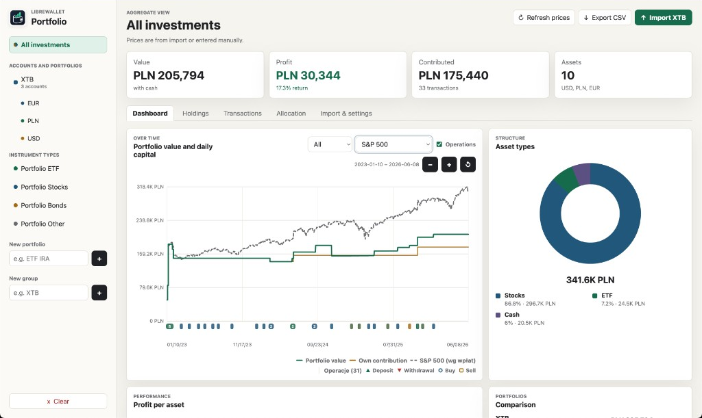
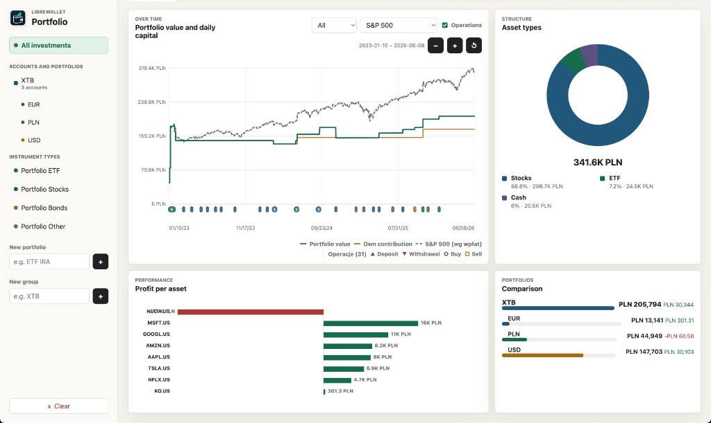
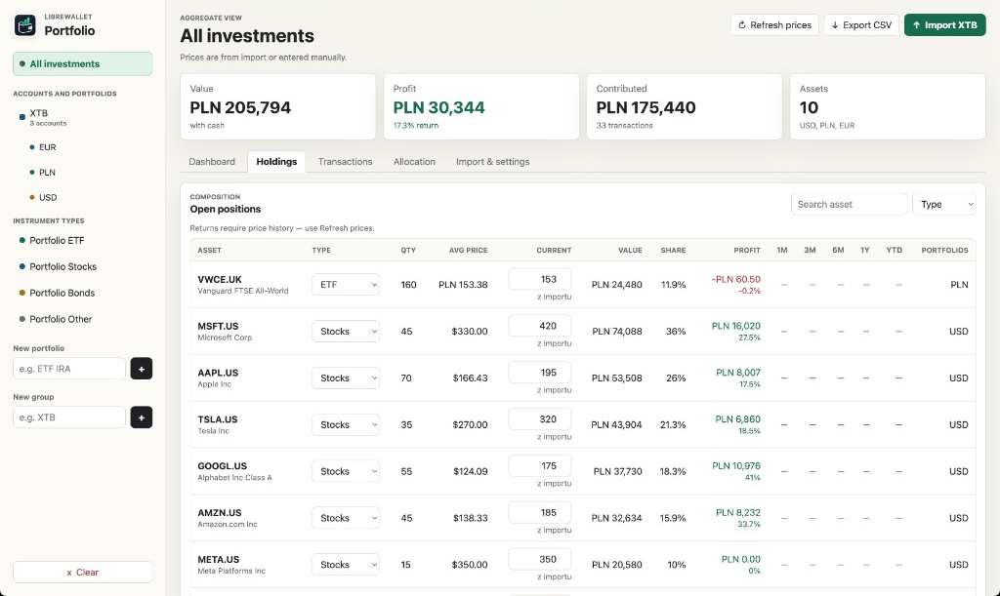
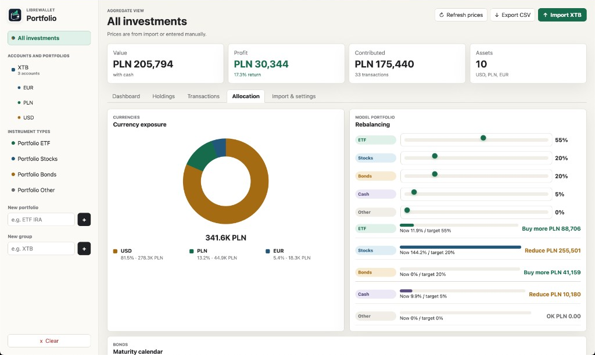

# LibreWallet — lokalny tracker portfela

**Język:** **Polski** · [English](README.md)

Śledź swoje inwestycje na komputerze. **Dane nie wychodzą poza Twój Mac** — bez konta w chmurze, bez zewnętrznego serwera.

## Zrzuty ekranu

*Przykładowe, fikcyjne dane — Apple, Microsoft, Google, Amazon, NVIDIA, Tesla, Meta i inne.*

## Pobierz

Najnowszą wersję znajdziesz w **[Releases](https://github.com/wedishprocentahc/librewallet/releases)**.

| System | Plik |
|--------|------|
| macOS (Apple Silicon — M1/M2/M3/M4) | `LibreWallet-1.1.1-mac-arm64.pkg` |
| macOS (Intel) | `LibreWallet-1.1.1-mac-x64.pkg` |
| Windows | `LibreWallet-1.1.1-win.exe` |

---

## Instalacja na Macu (Apple Silicon) — krok po kroku

Dla Maców z procesorem **Apple Silicon** (M1, M2, M3, M4).

### Krok 1 — sprawdź, czy masz właściwy Mac

1. Kliknij **** w lewym górnym rogu.
2. Wybierz **Informacje o tym Macu**.
3. Przy **Chip** powinno być *Apple M1*, *Apple M2*, *Apple M3* lub *Apple M4*.
4. Jeśli widzisz **Intel**, pobierz `mac-x64.pkg`, nie `mac-arm64.pkg`.

### Krok 2 — pobierz instalator

1. Wejdź na [Releases](https://github.com/wedishprocentahc/librewallet/releases).
2. Kliknij najnowszą wersję (np. **v1.1.1**).
3. Pobierz **`LibreWallet-1.1.1-mac-arm64.pkg`**.
4. Plik trafi do folderu **Pobrane**.

### Krok 3 — uruchom instalator (macOS może zablokować plik)

LibreWallet nie jest z App Store — **zwykły dwuklik często nie zadziała za pierwszym razem**. To normalne.

**Najprościej — prawy przycisk i Otwórz:**

1. **Finder** → **Pobrane**.
2. Znajdź `LibreWallet-…-mac-arm64.pkg`.
3. **Kliknij prawym przyciskiem** (nie lewym).
4. Wybierz **Otwórz**.
5. W okienku ostrzeżenia kliknij ponownie **Otwórz**.

**Jeśli nadal nie działa — Ustawienia systemowe:**

1. Spróbuj dwukliknąć `.pkg` — pojawi się komunikat o blokadzie.
2. **Ustawienia systemowe** → **Prywatność i ochrona**.
3. Na dole, w **Bezpieczeństwo**, kliknij **Otwórz mimo to** przy LibreWallet.
4. Podaj hasło do Maca, jeśli trzeba.
5. Uruchom instalator ponownie z **Pobrane**.

### Krok 4 — przejdź kreator instalacji

1. Klikaj **Kontynuuj** / **Dalej**.
2. Na końcu **Zainstaluj** i podaj hasło.
3. Poczekaj na **Instalacja zakończona pomyślnie**.

### Krok 5 — wybierz język

Po instalacji wybierz **Polski** lub **English**. Później zmienisz to w **Import i ustawienia → Język**.

### Krok 6 — pierwsze uruchomienie

1. LibreWallet jest w **Aplikacjach** i powinien sam otworzyć przeglądarkę.
2. Jeśli macOS **zablokuje aplikację** (nie instalator):
   - **Finder** → **Aplikacje** → **LibreWallet**
   - **Prawy przycisk** → **Otwórz** → **Otwórz**
   - Albo: **Ustawienia systemowe** → **Prywatność i ochrona** → **Otwórz mimo to**

### Krok 7 — gotowe

- Działa w Safari, Chrome lub Firefox.
- Dane portfela zostają **tylko na tym komputerze**.
- Kopia zapasowa: **Import i ustawienia → Kopia zapasowa**.

---

## Windows

1. Pobierz `LibreWallet-1.1.1-win.exe` z [Releases](https://github.com/wedishprocentahc/librewallet/releases).
2. Uruchom dwuklikiem — otworzy się przeglądarka.

Więcej w plikach **`INSTALL.txt`** i **`INSTALL.en.txt`**.

---

## Co robi LibreWallet

- śledzi portfele i rachunki XTB (PLN, EUR, USD),
- importuje operacje z eksportów XTB,
- pokazuje ceny, wykresy i benchmarki,
- obsługuje obligacje, cele i rebalancing,
- interfejs po polsku i angielsku.

## Twoje dane

Wszystko zostaje na Twoim komputerze. Rób regularne kopie w **Import i ustawienia → Kopia zapasowa**. Internet jest potrzebny głównie do odświeżania cen.

**Wskazówka XTB:** zaimportuj całą paczkę ZIP ze wszystkimi rachunkami (PLN + EUR + USD) naraz.
